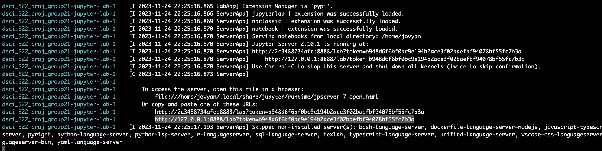

# Identifying the Top Three Predictors of Term Deposit Subscriptions Analysis

  - Authors: Jerry Yu, John Shiu, Sophia Zhao, Zeily Garcia
  - Contributors: 

This repository contains the code and analysis for the project "Identifying the Top Three Predictors of Term Deposit Subscriptions". Our team has explored a dataset from a Portuguese bank's marketing campaigns to understand what factors contribute to clients' decisions to subscribe to term deposits.

## About

This repository documents our analysis on the determinants of term deposit subscriptions within a Portuguese bank, harnessing a dataset that tracks 45,211 client interactions across 17 distinct variables. We have considered logistic regression and decision tree classifier to unearth the top three principal factors that predict a client's propensity to subscribe to a term deposit. The data preprocessing involves handling of missing entries, encoding of categorical variables, and standardization of numerical variables to prepare for robust analysis.

The crux of our exploratory data analysis was the strategic use of visualizations to unravel the nuances in feature distributions and inter-feature correlations. Our model evaluation was meticulously tailored to emphasize precision, a decision dictated by the inherent class imbalance present within the dataset as well as minimizing the false positive rate. In this rigorous analytical process, logistic regression emerged as a marginally more precise model compared to the decision tree classifier.

Significantly, the analysis culminated in pinpointing the outcome of prior marketing campaigns, the timing of client contact within the year, and the duration of the calls as pivotal indicators of subscription likelihood. These insights not only shed light on the client's decision-making dynamics but also carve out potential avenues for further scholarly inquiry and practical application in marketing strategies for banking products.

## Insights and Future Directions

The report's findings are instrumental for banking institutions to comprehend and predict customer behavior concerning term deposit subscriptions. This predictive understanding is essential for refining marketing approaches and enhancing the efficiency of future campaigns. We believe that these insights can serve as a cornerstone for further research, potentially exploring more sophisticated analytical models and integrating additional datasets to delve into the observed seasonal patterns and other underlying phenomena influencing client decisions.

## Report

The complete report can be found [here](https://htmlpreview.github.io/?https://github.com/UBC-MDS/dsci522_group21/blob/main/src/term_deposit_report.html).

## Usage

There are two ways of using this repository: by creating our conda environment, or by using Docker.

### Conda Environment

To replicate the analysis:

1. Clone this repository.
   ```bash
   git clone https://github.com/UBC-MDS/dsci522_group21.git
   ```
2. Install the required dependencies. When running for the first time, please create conda environment by running this command:
   ```bash
   conda env create -f environment.yml
   ```
3. Run the following command to activate the installed environment:
   ```bash
   conda activate 522
   ```
4. Launch Jupyter Lab by running `jupyter lab` and navigate to the `src/term_deposit_report.ipynb` notebook. Then, from the "Kernel" menu, select "Restart Kernel and Run All Cells...".
   ```bash
   Jupyter Lab
   ```

### Docker

There are two ways to run the analysis in a Docker container. However, one always needs to first clone the repo:

```bash
git clone git@github.com:UBC-MDS/dsci522_group21.git
```

#### (method 1) build/pull image and run
In the first method, one needs to obtain our Docker image in one of two ways:

1. In the root folder of the repository, run `docker build --tag <your_image_name> .`, or,
2. In the command line, run `docker pull johnshiu/dsci522_group21:main`. You should now have the image, and it is called `johnshiu/dsci522_group21`.

To run use the image, run:

```bash
docker run --rm -p 8888:8888 -v $(pwd):/home/jovyan <your_image_name>
```

One can then open jupyter lab using the link given by the command line output.

#### (method 2) docker-compose
In the second method, to create and run the container, one can run:

```bash
docker-compose up
```

This command will create an image if it does not already exist. After the user is finished with the analysis, press `Ctrl + C` on the keyboard on the command window, and then run `docker-compose down` to shut down the container.

#### run analysis
After running one of the above methods, in the terminal, copy the URL that starts with `http://127.0.0.1:8888/lab?token=` (for example, see the highlighted text in the terminal below), and paste it into your browser.


To run the analysis, navigate to the `src/term_deposit_report.ipynb` notebook. Then, from the "Kernel" menu, select "Restart Kernel and Run All Cells...". 

### Run Unit Tests

In the root folder of the repository, run:

```bash
pytest 
```


## Dependencies

```raw
- python=3.11
- ipython=8.17.2
- ipykernel=6.26.0
- jupyterlab=4.0.9
- matplotlib=3.8.2
- pandas=2.1.3
- scikit-learn=1.3.2
- altair=5.1.2
- vl-convert-python=1.1.0
- vegafusion=1.4.5
- vegafusion-jupyter=1.4.5
- pytest=7.4.3

```

## File Consumption Order

1. Datasets: `bank-full.csv`, `bank-names.csv`, `bank.csv`, `bank-additional-full.csv`, `bank-additional-names.csv`, `bank-additional.csv`
2. Scripts: `term_deposit_report.ipynb`, `term_deposit_full_analysis.ipynb`
3. Report: `term_deposit_report.html`

## License

This project is licensed under the MIT License - see the LICENSE.md file for details.  

# References

- Harris, C.R. et al., 2020. Array programming with NumPy. Nature, 585, pp.357–362.
- Moro,S., Rita,P., and Cortez,P., 2012. Bank Marketing. UCI Machine Learning Repository. https://doi.org/10.24432/C5K306.
- Ostblom,J., 2023. environment.yaml. DSCI_573_feat-model-select_students Repository. https://github.ubc.ca/MDS-2023-24/DSCI_573_feat-model-select_students/blob/fc08e3246ff07f0425942d1b97429d5d0ebce933/environment.yaml.
- Pedregosa, F. et al., 2011. Scikit-learn: Machine learning in Python. Journal of machine learning research, 12(Oct), pp.2825–2830.
- Timbers,T. , Ostblom,J., and Lee,M., 2023. Breast Cancer Predictor Report. GitHub repository, https://github.com/ttimbers/breast_cancer_predictor_py/blob/0.0.1/src/breast_cancer_predictor_report.ipynb.
- Van Rossum, Guido, and Fred L. Drake. 2009. Python 3 Reference Manual. Scotts Valley, CA: CreateSpace.
- VanderPlas, J. et al., 2018. Altair: Interactive statistical visualizations for python. Journal of open source software, 3(32), p.1057.
